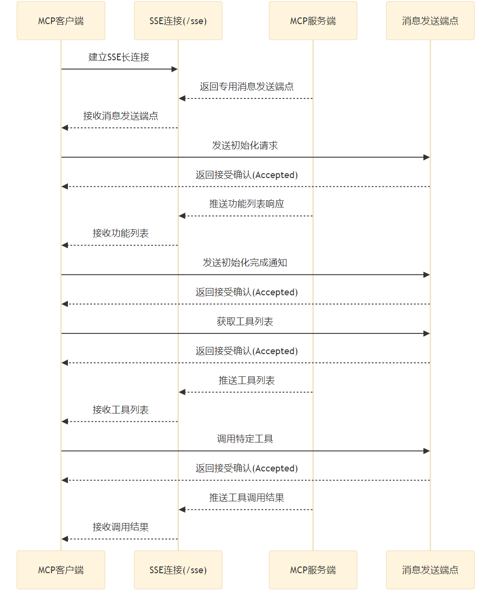

# MCP Server of Node 基础框架开发总结

## 一、项目概述

### 1.1 项目背景
- **目标**: 创建一个可复用的MCP(Model Context Protocol)服务器基础框架
- **用途**: 支持AI客户端(如Cursor)与自定义服务的通信
- **架构**: 支持标准MCP协议和SSE(Server-Sent Events)实时通信

### 1.2 核心特性
- 标准MCP协议支持(JSON-RPC 2.0)
- SSE实时通信功能
- 模块化架构设计
- 灵活的工具注册系统
- 内置Web界面和HTTP服务
- CLI和库双重使用模式

## 二、MCP协议实现

### 2.1 MCP核心概念

#### 2.1.1 MCP协议
MCP (Model Context Protocol) 是一个开放标准，用于连接AI助手与数据源和工具。它基于JSON-RPC 2.0协议，提供了标准化的通信方式。
- Tools：使大语言模型能够通过你的 Server 执行操作。
- Resources：将 Server 上的数据和内容开放给大语言模型。
- Prompts：创建可复用的提示词模板和工作流程。

**核心特性：**
- 基于JSON-RPC 2.0协议的消息格式
- 双向通信：客户端-服务器请求响应模式
- 标准化的错误处理机制
- 会话状态管理


**基础消息格式：**

```typescript
// 基础请求结构
interface MCPRequest {
    jsonrpc: "2.0";                    // 协议版本(固定值)
    id: number | string;               // 请求唯一标识符
    method: string;                    // 调用的方法名
    params?: any;                      // 方法参数(可选)
}

// 基础响应结构
interface MCPResponse {
    jsonrpc: "2.0";                    // 协议版本(固定值)  
    id: number | string;               // 对应请求的ID
    result?: any;                      // 成功结果(可选)
    error?: MCPError;                  // 错误信息(可选)
}

// 错误结构
interface MCPError {
    code: number;                      // 错误码
    message: string;                   // 错误消息
    data?: any;                        // 额外错误数据(可选)
}
```

**核心方法：**

1. **initialize** - 初始化连接
```typescript
// 请求
{
    "jsonrpc": "2.0",
    "id": 0,
    "method": "initialize", 
    "params": {
        "protocolVersion": "2024-11-05",
        "capabilities": {
            "tools": {},                // 工具能力
            "resources": {},           // 资源能力  
            "prompts": {}             // 提示词能力
        },
        "clientInfo": {
            "name": "mcp-client",
            "version": "1.0.0"
        }
    }
}

// 响应
{
    "jsonrpc": "2.0",
    "id": 0,
    "result": {
        "protocolVersion": "2024-11-05",
        "capabilities": {
            "tools": { "listChanged": true },
            "resources": { "subscribe": true },
            "prompts": { "listChanged": true }
        },
        "serverInfo": {
            "name": "mcp-server-of-node",
            "version": "1.0.0"
        }
    }
}
```

2. **tools/list** - 获取工具列表
```typescript
// 请求
{
    "jsonrpc": "2.0",
    "id": 1,
    "method": "tools/list"
}

// 响应
{
    "jsonrpc": "2.0", 
    "id": 1,
    "result": {
        "tools": [
            {
                "name": "show_weather",
                "description": "查询指定城市的天气信息",
                "inputSchema": {
                    "type": "object",
                    "properties": {
                        "location": {
                            "type": "string",
                            "description": "城市名称"
                        }
                    },
                    "required": ["location"]
                }
            }
        ]
    }
}
```

3. **tools/call** - 调用工具
```typescript
// 请求
{
    "jsonrpc": "2.0",
    "id": 2,
    "method": "tools/call",
    "params": {
        "name": "show_weather",
        "arguments": {
            "location": "深圳"
        }
    }
}

// 响应
{
    "jsonrpc": "2.0",
    "id": 2,
    "result": {
        "content": [
            {
                "type": "text",
                "text": "天气信息: 深圳, 天气晴朗, 温度20度, 湿度50%"
            }
        ],
        "isError": false
    }
}
```

**错误处理：**

MCP协议定义了标准错误码：
- `-32700`: 解析错误 (Parse error)
- `-32600`: 无效请求 (Invalid Request)  
- `-32601`: 方法未找到 (Method not found)
- `-32602`: 无效参数 (Invalid params)
- `-32603`: 内部错误 (Internal error)
- `-32000 到 -32099`: 服务器保留错误码

```typescript
// 错误响应示例
{
    "jsonrpc": "2.0",
    "id": 1,
    "error": {
        "code": -32601,
        "message": "Method not found",
        "data": {
            "method": "unknown_method"
        }
    }
}
```

**通知消息：**

某些消息是单向通知，不需要响应：
```typescript
// 初始化完成通知
{
    "jsonrpc": "2.0",
    "method": "notifications/initialized"
}

// 工具列表变更通知
{
    "jsonrpc": "2.0", 
    "method": "notifications/tools/list_changed"
}
```

```typescript
// MCP工具信息
export type InputSchema = {
    type: string; // object
    properties: { // 属性列表
        [key: string]: {
            type: string;
            description: string;
        };
    };
    required: string[]; // 必填字段
}

export type ToolArgs = {
    name: string;
    title: string;
    description: string;
    inputSchema: InputSchema;
    handle: (args: object) => Promise<ToolResult>; // 工具处理函数
}

// Tool返回信息协议
export type ToolResult = {
    toolName: string;
    toolArgs: any;
    isError: boolean;
    content: {
        type: string; // text, image, video, audio, file, link, table, list, other
        text?: string;
        image?: string;
        video?: string;
        audio?: string
        file?: string;
        link?: string;
        table?: string;
        list?: string;
        other?: string;
    }[];
}

```
#### 2.1.2 MCP协议数据示例
```
// Tools定义
 const tools = [{
        name: 'show_weather',
        description: '读取天气信息',
        title: '读取天气信息',
        inputSchema: {
            type: 'object',
            properties: {
                location: { type: 'string', description: 'location' },
            },
            required: ['location'],
        },
        handle: async (args: any): Promise<ToolResult> => {
            // 返回数据
            return {
                content: [{
                    type: "text",
                    text: `天气信息: ${args.location}, 天气晴朗, 温度20度, 湿度50%`,
                }],
                toolName: 'show_weather',
                toolArgs: args,
                isError: false
            };
        }
    }];

const response = {
    "jsonrpc": "2.0",
    "id": 0,
    "result": ${tools}
}

// Tools返回数据
const toolHandlerResult = {
                content: [{
                    type: "text",
                    text: `天气信息: ${args.location}, 天气晴朗, 温度20度, 湿度50%`,
                }],
                toolName: 'show_weather',
                toolArgs: args,
                isError: false
};

const toolResponse = {
    "jsonrpc": "2.0",
    "id": 0,
    "result": ${toolHandlerResult}
}
```

### 2.2 MCP SSE协议

MCP 的 SSE Transport 结合了 SSE 和 HTTP POST，形成了以下工作流程：



#### 2.2.1 SSE Transport 交互流程

**1. 建立连接：**
- 客户端通过 HTTP GET 请求访问服务器的 SSE 端点（例如 /sse）
- 服务器响应一个 text/event-stream 类型的内容，保持连接打开
- 服务器发送一个初始的 endpoint 事件，包含一个唯一的 URI（例如 /messages?session_id=xxx），客户端后续通过这个 URI 发送消息
```
// 建立连接
curl -X get 'http://localhost:3000/sse

// 服务器发送一个初始的 endpoint 事件，包含一个唯一的 URI
event: endpoint
data: /messages/?session_id=2b3c8777119444c1a1b26bc0d0f05a0a

```

**2. 服务器到客户端的消息推送：**
- 服务器通过 SSE 连接，将 JSON-RPC 格式的消息，以事件流的形式发送给客户端
- 客户端通过 EventSource 或类似机制监听这些事件

**3. 客户端到服务器的消息发送：**
- 客户端通过 HTTP POST 请求将消息，发送到服务器提供的 URI（例如 /messages）
- 服务器接收并处理这些请求，返回响应或通过 SSE 推送结果

**4. 连接管理：**
- SSE 连接是单向的（服务器到客户端），通常通过定期发送心跳消息（keep-alive）保持活跃
- 如果连接断开，客户端可以重新发起 SSE 请求重建连接

#### 2.2.2 数据格式
- MCP 使用 JSON-RPC 2.0 协议封装消息，确保请求和响应的结构化处理
- SSE 消息遵循 `event:\ndata:\n\n` 的格式

#### 2.2.3 关键方法实现
- **initialize**: 客户端初始化连接
```
// 请求：
curl -X POST 'http://localhost:3000/messages/?session_id=2b3c8777119444c1a1b26bc0d0f05a0a' -H 'Content-Type: application/json' -d '{
    "jsonrpc": "2.0",
    "id": 0,
    "method": "initialize",
    "params": {
      "protocolVersion": "2024-11-05",
      "capabilities": {},
      "clientInfo": {
        "name": "mcp",
        "version": "0.1.0"
      }
    }
}'

// 响应消息
event: message
data: {
	"jsonrpc": "2.0",
	"id": 0,
	"result": {
		"protocolVersion": "2024-11-05",
		"capabilities": {
			"experimental": {},
			"prompts": {
				"listChanged": false
			},
			"resources": {
				"subscribe": false,
				"listChanged": false
			},
			"tools": {
				"listChanged": false
			}
		},
		"serverInfo": {
			"name": "weather",
			"version": "1.3.0"
		}
	}
}

```
- **notifications/initialized**: 初始化完成通知
```
// 请求：
curl -X POST 'http://localhost:8000/messages/?session_id=2b3c8777119444c1a1b26bc0d0f05a0a' -H 'Content-Type: application/json' -d '{
    "jsonrpc": "2.0",
    "method": "notifications/initialized",
    "id": 1,
    "params": {}
}'

//无需回复

```

- **tools/list**: 获取可用工具列表
```
// 请求：
curl -X POST 'http://localhost:8000/messages/?session_id=2b3c8777119444c1a1b26bc0d0f05a0a' -H 'Content-Type: application/json' -d '{
    "jsonrpc": "2.0",
    "id": 2,
    "method": "tools/list",
    "params": {}
}'

// 响应消息
event: message
data: {
	"jsonrpc": "2.0",
	"id": 2,
	"result": {
		"tools": [{
        name: 'show_weather',
        description: '读取天气信息',
        title: '读取天气信息',
        inputSchema: {
            type: 'object',
            properties: {
                location: { type: 'string', description: 'location' },
            },
            required: ['location'],
        }]
	}
}
```
- **tools/call**: 调用具体工具
```
// 请求：
curl -X POST 'http://localhost:8000/messages/?session_id=2b3c8777119444c1a1b26bc0d0f05a0a' -H 'Content-Type: application/json' -d '{
    "jsonrpc": "2.0",
    "id": 3,
    "method": "tools/call",
    "params": {"name": "show_weather", "arguments": {"location": "深圳"}}
}'

// 响应消息
event: message
data: {
	"jsonrpc": "2.0",
	"id": 3,
	"result":  {
		"content": [{
            type: "text",
            text: `天气信息: ${args.location}, 天气晴朗, 温度20度, 湿度50%`,
		}],
		"isError": false
    }
}

```


## 三、总结

这个MCP基础框架成功实现了:
1. 标准MCP协议的完整支持
2. 灵活的工具系统架构
3. SSE实时通信能力
4. 良好的开发者体验
5. CLI和库的双重使用模式

为AI应用开发提供了稳定、易用的基础设施，支持快速构建各种MCP服务。
